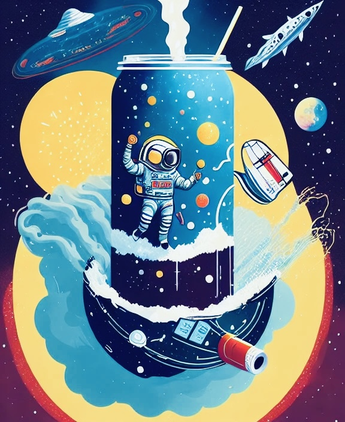

# Welcome to SODAverse 🪐🌟

This is the official repository for our paper:<br>[<b>SODA: Million-scale Dialogue Distillation with Social Commonsense Contextualization</b>](https://arxiv.org/abs/2212.10465)<br>



```
@article{kim2022soda,
    title={SODA: Million-scale Dialogue Distillation with Social Commonsense Contextualization},
    author={Hyunwoo Kim and Jack Hessel and Liwei Jiang and Peter West and Ximing Lu and Youngjae Yu and Pei Zhou and Ronan Le Bras and Malihe Alikhani and Gunhee Kim and Maarten Sap and Yejin Choi},
    journal={ArXiv},
    year={2022},
    volume={abs/2212.10465}
}
```

For a brief summary of our paper, please see this [tweet](https://twitter.com/hyunw__kim/status/1605400305126248448).


## 🥤SODA

You can now load SODA from the [HuggingFace hub](https://huggingface.co/datasets/allenai/soda) as the following:
```python
from datasets import load_dataset

dataset = load_dataset("allenai/soda")
```

## 🧑🏻‍🚀COSMO

You can now load COSMO-3B from the [HuggingFace hub](https://huggingface.co/allenai/cosmo-xl).

### Have a chat with Cosmo!

> 🚨 <b>Disclaimer:</b> We would like to emphasize that COSMO is trained on SODA and ProsocialDialog mainly for academic/research purposes. We discourage using COSMO in real-world applications or services as is. Model outputs should not be used for advice for humans, and could be potentially offensive, problematic, or harmful. The model’s output does not necessarily reflect the views and opinions of the authors and their associated affiliations.

#### Environment setup

We recommend you create a conda environment as follows:

```bash
conda env create -f environment.yml
```

and activate it with

```bash
conda activate sodaverse
```

#### Running Cosmo

By running the command below, Cosmo will be automatically downloaded and you can have a chat!

```bash
python chat_with_cosmo.py
```

#### Limitations

Cosmo is mostly trained on social chitchat. Therefore, we do not encourage having knowledge-intensive conversations (e.g., science, medical issues, law).
For detailed limitations, please refer to our [paper](https://arxiv.org/abs/2212.10465).

## Other

We will also be releasing our 🫧CO<sub>3</sub>! Stay tuned!
